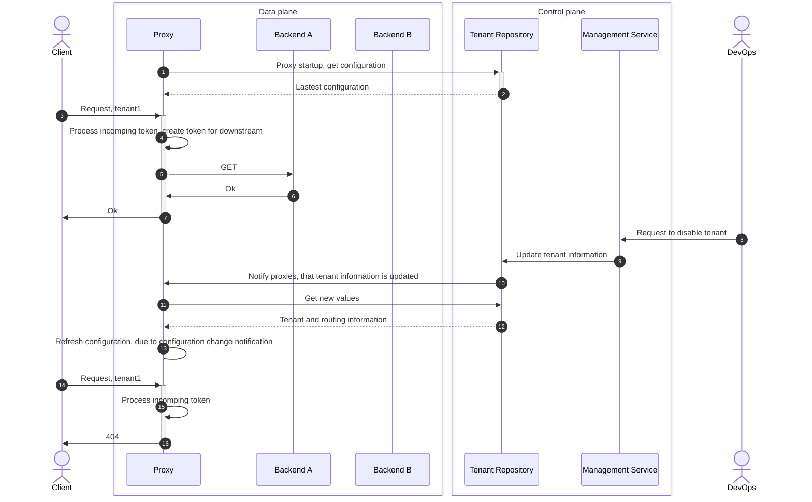

```mermaid
sequenceDiagram
autonumber
actor Client

#RP ->> CS : Proxy startup, read lastest configuration
box Data plane
participant RP as Proxy
participant BEA as Backend A
participant BEB as Backend B
end
RP ->> +CS : Proxy startup, get configuration
CS -->> -RP : Lastest configuration
Client ->>+RP : Request, tenant1
RP ->> RP : Process incomping token, create token for downstream
RP->> BEA : GET
BEA ->> RP : Ok
RP ->> -Client : Ok

box Control plane
participant CS as Tenant Repository
participant MS as Management Service
end
Actor DevOps
DevOps ->> MS : Request to disable tenant 
MS->> CS : Update tenant information
CS->> RP : Notify proxies, that tenant information is updated
RP ->> CS : Get new values
CS -->> RP : Tenant and routing information
RP->RP : Refresh configuration, due to configuration change notification
Client ->>+RP : Request, tenant1
RP ->> RP : Process incomping token
RP ->> -Client : 404

```
