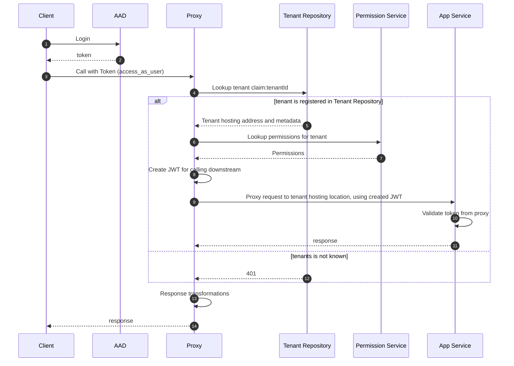

```mermaid
sequenceDiagram
autonumber
Client->>AAD : Login
AAD-->>Client : token
Client->>Proxy : Call with Token (access_as_user)
Proxy->> Tenant Repository : Lookup tenant claim:tenantId 
alt tenant is registered in Tenant Repository
Tenant Repository -->> Proxy : Tenant hosting address and metadata
Proxy->> Permission Service : Lookup permissions for tenant
Permission Service -->> Proxy : Permissions 
Proxy ->> Proxy : Create JWT for calling downstream
Proxy ->> App Service : Proxy request to tenant hosting location, using created JWT
App Service ->> App Service : Validate token from proxy
App Service -->> Proxy : response

else tenants is not known
Tenant Repository -->> Proxy : 401 
end
Proxy ->> Proxy : Response transformations
Proxy -->> Client : response

```