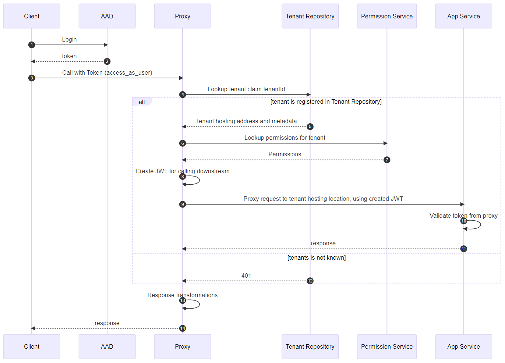
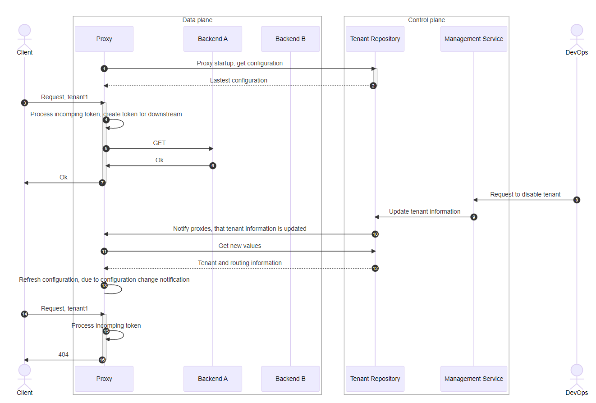
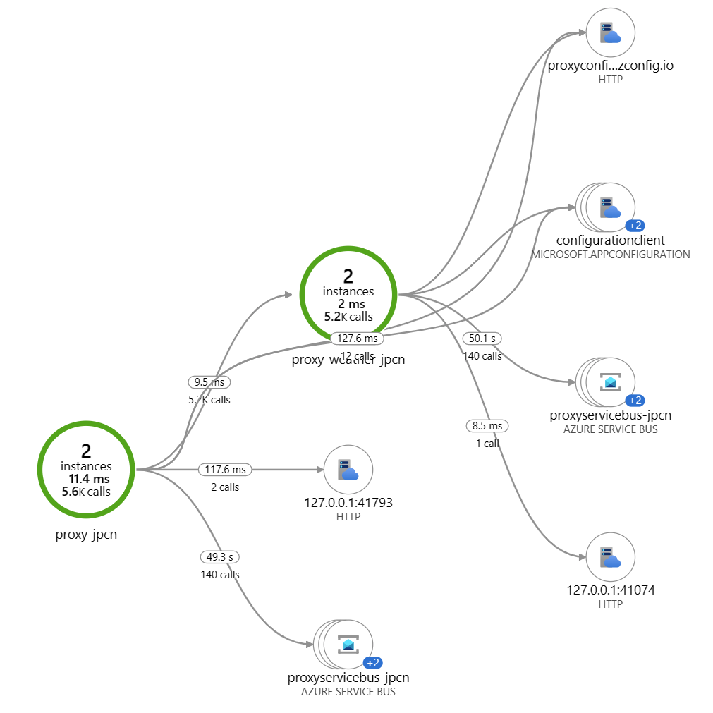
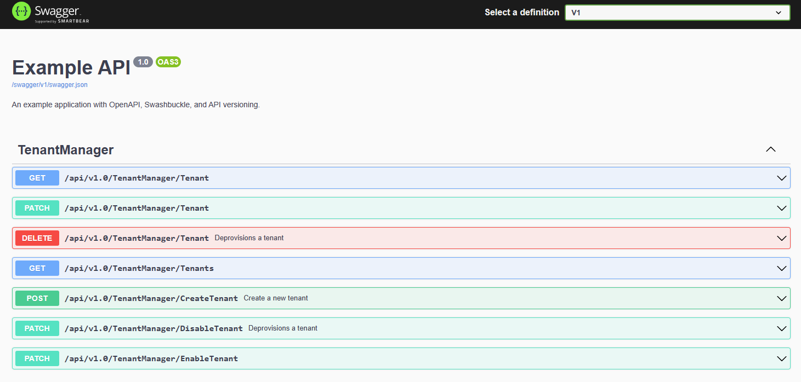

# Reverse Proxy - managing and routing tenants 

Tenant routing rules, claims processing, and authentication protocol translations are often needed for exposing a backend to any number of frontends and clients. A reverse proxy serves to hide some of this complexity for the frontends connecting as well as centralizing the management.  Scenarios are amongst:

* Frontend leverages modern OAuth, backend services do not. Transformation is needed for downstream calls. Like OICD/OAuth transformation to other legacy auth used downstream from proxy
* Token claim enrichments or creating new tokens to be used downstream - i.e. add additional claims, like membership, etc.
* Existing backend has specific tenant routing requirements like subdomains (**customer1**.contoso.com), query parameters, path segments, headers, or claims from bearer tokens. 
* Specific handling of tenants in a multitenant backend (like special treatment for paid vs unpaid tenants) or handling limits pr tenant, pr client, or other dimensions

A reverse proxy or gateway can solve these and other challenges, as it sits between client devices and one or more backend servers, forwarding client requests to servers and then returning the server's response back to the client. The [Gateway Routing pattern](https://learn.microsoft.com/en-us/azure/architecture/patterns/gateway-routing) speaks to and addresses these challenges.

The current sample uses [YARP proxy](https://microsoft.github.io/reverse-proxy/articles/getting-started.html), as the reverse proxy implementation. Services like Application Gateway and API Management, provide much of the same, and more, functionality. These existing PaaS services do not offer token-based routing or claims transformation, like adding claims or mapping to other auth protocols. YARP provides that flexibility, as the pipeline is fully extendable. 

## Main components

The sample consists of the following:

1. YARP proxy implementation which routes tenants to different backends based on the AAD tenant id. Deployed on an Azure web application. 

1. A Tenant Repository (```ITenantRepository```), is used to serve information regarding tenants. For data persistence, it's using Azure App Configuration as the store for known tenants. Any data store could be used. Azure App Configuration provides some benefits like versioning and restore of configurations and change events. [Here dynamic configuration is used](https://github.com/henrikwh/azure-app-configuration-sample), causing changes in App Configuration to be pushed to subscribers-

1. Backend API, which tenants are routed to. This is the weather API, but *configured to authorize using the token issued from the proxy*. 

1. A tenant management service (API) with OpenAPI exposed. This acts as the interface to update the tenant repository. Not deployed with scripts above. 

## Tenant routing

The end-to-end flow for performing a request from a client (tenant) to a designated backend involved these steps:

1. Proxy receives an authorized request

2. Proxy inspects the bearer token and extracts claims needed. In this case, only `http://schemas.microsoft.com/identity/claims/tenantid` claim is used

3. Proxy uses tenant id to retrieve tenant information in Tenant Repository. Tenant Repository contains hosting Uri and state of the tenant (enabled or disabled)

4. Additional permissions are read from the 'Permission Service', depending on what the downstream services need

5. Proxy creates a new self-signed JWT and uses that downstream when proxying to the hosting location for the tenant. This could be any transformation required for calling downstream services. In this sample, the  permission service is called to add additional claims to the JWT

6. Request is proxied based on information from the "tenant repository".

Sequence diagram below illustrates the flow.



## Tenant management

The sample includes a simple management abstraction that allows for configuring tenant settings/routing.  Configuration storage is handled in Azure App Configuration as the [external configuration store](https://learn.microsoft.com/en-us/azure/architecture/patterns/external-configuration-store), but any other backing store could be implemented. This would typically be deployed as part of the SaaS [control plane](https://learn.microsoft.com/en-us/azure/architecture/guide/multitenant/considerations/control-planes). A tenant management component/service handles scenarios like:

- Adding, removing/blocking tenants
- Assigning capacity, limits pr tenant, limits pr hosting service
- Reassigning tenants to new hosts, by changing destination for tenants

Here changes to the routing configuration are pushed to subscribing proxies. 

The high level sequence diagram for calling the backend looks like:




Some key considerations are that the proxy requires hosting, maintenance, and operations and that the proxy is on the critical path. Application Gateway or API Management are hosted services and takes these responsibilities. Besides that, adding a proxy, or gateway, have a cost and adds an additional layer of processing which will have some performance impact.  Networking configuration has not been included in this sample, where for most cases, deployments would be performed into separate subnets and a web application firewall would front the proxy. 


### Observability

The sample is configured to send to application insights. This gives the operational telemetry needed to inspect how proxy and downstream services are performing and operating. 

> **Note:**  Trace levels are configured centrally in App Configuration, in the configuration `API:Settings${environment}`. Other application insights functionality, like dependency tracing, can also be centrally enabled or disabled.

Having visibility into the end-to-end request is essential. The KQL below shows how a specific request can be traced using `operation_id`.

```kql
let opid ="INSERT OPERATIOb_ID";
union requests,traces,dependencies, exceptions
| where operation_Id == opid or operation_ParentId  == opid
| extend CategoryName_ = tostring(customDimensions.CategoryName)
| extend executingProcess = strcat(cloud_RoleName, '-',cloud_RoleInstance)
| project-reorder timestamp,itemType, operation_Id, executingProcess, name, message,CategoryName_, url, duration
| order by timestamp asc  		
```


Requests, traces, and dependencies are logged. Above shows the request to the proxy, trace for the proxy (Proxying to..), the dependency trace, the request to the weather API, and finally the trace response. 

#### Application map

The application map shows the communication between services. The obvious are calls from proxy and downstream to weather API. There are also a few other dependencies shown, that illustrate how the service operates:



* `127.0.0.1:*` - looking into that reveals `GET 127.0.0.1:41793/msi/token/`. This is the service getting a token for the managed identity used to connect other services
* `proxyservicebus-*` is the subscription to the Service Bus topic which nodes subscribe to, to get notified of configuration changes
* `configurationclient`  - calls to configuration client are triggered once a node receives a message on the Service Bus. 

### Building and deploying the sample

Install scripts are tested on Ubuntu on WSL.

*Main principle for the scripts* is to store variables in `config.json` once scripts run. That will result in specific deployment parameters, which are used in Bicep to provision and configure. `config.json` is also used directly by ASP.NET core configuration provider if the sample is running locally.

1. Clone the repository

2. Go to the scripts folder

3. Optional: run `./preReqs.sh` to install needed prerequisites. 
   For manual installation of the prerequisites: `apt install jq zip azure-cli dotnet-sdk-7.0`
   
4. run `./aadApp.sh` to create application registration in AAD. This will create a multitenant AAD app, which the proxy will use.

5. run `./provision.sh` to provision Azure resources, using Bicep.

7. run `./addCurrentTenantToRepository.sh`, this will create a registration that will route your tenant the weather API installed for testing 
   routing information is stored in App Configuration under `TenantDirectory:Tenants$Production` with this format:

    ```json
    [
        {
            "Tid": "{Id of the AAD tenant, for which the proxy will route requests}",
            "Destination": "https://{Replace with weather api prefix}.azurewebsites.net",
            "Alias": "{Tenant-Something}",
            "State":"Enabled"
        }
    ]
    ```
8. run `./deploy.sh` to build the solution and deploy the solution    

#### Setting up Postman to call the APIs

A Postman environment is generated to help setup the authentication and to make the request against the proxy.

1) In the scripts folder, run `createPostmanEnvironment.sh`, this will generate an environment file and copy the sample collection.
2) Open Postman and import the generated files `TenantProxy-dev.postman_environment.json` and `TenantProxy.postman_collection.json`
   
3) In Postman select the imported environment, to make sure the right variables are used. The environment name contains the resourcegroup name for the deployment
4) Get a new access token, and press "Use Token". This will use the environment which contains the client id, scope etc.
    
5) Call the API, using the token
    
6) Enjoy the weather, served through the proxy, by the backend API the tenant is routed to

#### Running locally

From the scripts folder do the following:

1) Make sure that the above setup steps have been performed, to provision resources on Azure
2) From the scripts folder run `createDevServicePrincipal.sh`. This will create a service principal with permissions identical to the managed identity. Values are stored in `config.json` and read as part of the startup.
3) For startup projects, select multiple and select Proxy and WeatherApi. Proxy needs to run https on port 7001, and WeatherApi on port 9090.
4) If testing with Postman, use the request stored in the localhost folder
5) Ensure that the right configuration is loaded for the Development environment by going to Azure App Configuration and edit the configuration `TenantDirectory:Tenants$Development`. If *not* changed, routing will be towards the cloud deployment - which is also possible. 

##### Control plane APIs

For interacting with the control plane, there's a simple sample, that updates the Tenant Repository. It can be started locally (localhost), for test purposes, using a service principal to talk to App Configuration service.



Above are a few operations relevant for managing tenants.

### Summary

A reverse proxy works as an intermediary, in this case between clients and backends. Having a proxy or gateway in between enables inspection and rewrite of requests. For this sample, the scenario is to route tenants identified by the tenant id claim in the bearer token, to the right hosting endpoint in the backend. Tenant management is implemented to hold the individual configurations of the tenants. 

#### Resources

[YARP Documentation (microsoft.github.io)](https://microsoft.github.io/reverse-proxy/)

[Backends for Frontends pattern - Azure Architecture Center | Microsoft Learn](https://learn.microsoft.com/en-us/azure/architecture/patterns/backends-for-frontends)

Gateway routing: https://learn.microsoft.com/en-us/azure/architecture/patterns/gateway-routing

[External Configuration Store pattern - Azure Architecture Center | Microsoft Learn](https://learn.microsoft.com/en-us/azure/architecture/patterns/external-configuration-store)

[Federated Identity pattern - Azure Architecture Center | Microsoft Learn](https://learn.microsoft.com/en-us/azure/architecture/patterns/federated-identity)

